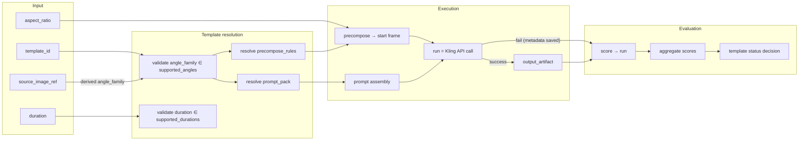

# ADR-0003: Template-first architecture

## Status

Proposed

## Date

2026-03-25

## Context

ADR-0002 зафиксировал границы V1. Domain model определил 8 сущностей и их атрибуты.
Остаётся открытым вопрос: **какая сущность является центральной точкой сборки**
и как через неё организуется весь workflow.

В проекте несколько сущностей могли бы претендовать на роль «центра»:
- **run** — потому что это конкретное выполнение;
- **prompt_pack** — потому что prompt напрямую определяет результат генерации;
- **template** — потому что объединяет конфигурацию, тестирование и lifecycle.

Необходимо зафиксировать архитектурное решение и его следствия.

## Decision

### Template = central assembly point

Template — центральная организующая сущность проекта.

Это означает:

1. **Template — точка сборки конфигурации.**
   Template объединяет ссылки на prompt_pack, precompose_rules, test_suite
   и параметры генерации (supported_angles, supported_durations, supported_aspect_ratios).
   Зная `template_id` + `source_image_ref` + derived `angle_family` + `aspect_ratio` + `duration`,
   система может полностью собрать запрос на генерацию.

2. **Template — точка входа для пользователя.**
   Пользователь выбирает template (+ aspect_ratio, duration).
   Всё остальное определяется template автоматически.
   `angle_family` берётся из source image / image-pipeline, а не выбирается пользователем.

3. **Template — единица lifecycle.**
   Статусы (draft → approved → archived) живут на template.
   Именно template проходит через тестирование и принимается или отвергается.

4. **Template — единица сравнения.**
   Когда сравниваются результаты, сравниваются templates
   (через агрегацию scores их runs), а не отдельные runs.

### Template — не god object

Template **не выполняет действия**. Он описывает конфигурацию.

- Template не вызывает Kling API — это делает adapter layer через run.
- Template не подготавливает start frame — это делает precompose pipeline по его правилам.
- Template не хранит результаты — результаты хранятся в run и output_artifact.
- Template не вычисляет scores — scores принадлежат runs.
- Template не владеет scoring criteria — критерии оценки определяются на уровне test_suite.

Template = **декларативная спецификация**, а не контроллер.

### Ключевые архитектурные инварианты

**И-1. template ↔ prompt_pack = 1:1 в V1.**
Один template — ровно один prompt_pack. Canonical source: ADR-0002, п. 13.

**И-2. Иерархия ограничений angles.**

- `family.compatible_angles` — максимум: какие angles вообще возможны для семейства
- `template.supported_angles` — подмножество: какие angles подтверждены для конкретного template

Инвариант: `template.supported_angles ⊆ family.compatible_angles`.
Template не может заявить поддержку angle, запрещённого на уровне family.

**И-3. run = atomic execution unit.**
Один run = один вызов Kling API с конкретными параметрами.
Run неделим. Частичных runs не существует.

Failed run остаётся полноценной run-записью и должен сохранять
request metadata и response metadata (включая error details),
даже если output_artifact не получен.

**И-4. score → run, не score → template.**
Score оценивает конкретный run. Агрегация scores по runs template
даёт оценку template, но это аналитическая операция, а не прямая связь.

**И-5. approved = status на template.**
Нет отдельной сущности «approved template».
Canonical source: domain-model.md, раздел «Решение: approved_template».

### Что template НЕ делает

Для ясности границ ответственности:

| Template не... | Это делает... |
|---|---|
| Не вызывает API | adapter layer (через run) |
| Не готовит start frame | precompose pipeline (по template.precompose_rules) |
| Не хранит результаты генерации | run → output_artifact |
| Не оценивает качество | scoring system (score → run) |
| Не определяет scoring criteria | test_suite.scoring_criteria |
| Не управляет очередью запусков | orchestration layer (за рамками V1) |
| Не содержит бизнес-логику маршрутизации | будущий selection layer (Phase 8) |

### Workflow: от выбора template до score

**Шаги:**

1. **User input.** Пользователь выбирает template, aspect_ratio, duration.
   `angle_family` извлекается из source image / image-pipeline.
2. **Validation.** Проверяется, что derived `angle_family` ∈ `template.supported_angles`
   и `duration` ∈ `template.supported_durations`.
3. **Precompose.** По `template.precompose_rules` и выбранному `aspect_ratio` готовится start frame.
4. **Prompt assembly.** Из `prompt_pack` берётся `motion_prompt`, `negative_prompt`,
   применяются `prompt_modifiers` (по angle, aspect_ratio).
5. **Run.** Один вызов Kling API. Результат — `output_artifact` (при успехе).
   При ошибке run-запись сохраняется с request/response metadata без artifact.
6. **Score.** Run оценивается (human, auto-rule или LLM-judge). Score привязан к run.
7. **Aggregation.** Scores по runs из test_suite агрегируются для принятия решения
   о статусе template.

## Consequences

### Какие риски снимает template-first архитектура

1. **Единая точка конфигурации.** Без template-first конфигурация была бы размазана
   между prompt_pack, precompose rules и run parameters. Любое изменение требовало бы
   правки в нескольких местах.

2. **Воспроизводимость.** Template фиксирует все параметры. Повторный run с тем же
   template и теми же входными данными должен давать идентичную конфигурацию запроса.
   (Стохастичность Kling — внешний фактор, не контролируемый template.)

3. **Тестируемость.** Именно template является единицей тестирования.
   Test suite привязан к template, а не к prompt или к run.

4. **Понятный lifecycle.** Template имеет статус. Можно однозначно ответить:
   «этот template прошёл тестирование» или «этот template нестабилен».

5. **Контролируемое расширение.** Когда в будущем появится A/B-тестирование
   prompt packs (1:N), template останётся точкой сборки — изменится только
   кардинальность связи, а не архитектура.

### Чем платим

- Template становится обязательным посредником. Нет «быстрого» способа
  запустить генерацию без template (ad-hoc runs всё равно привязаны к template_id).
- Все изменения prompt требуют обновления prompt_pack, который привязан к template.
  В V1 это не проблема (1:1), но при переходе к 1:N потребуется доработка.

## Открытые вопросы перед Phase 2

| # | Вопрос | Контекст |
|---|--------|----------|
| 1 | Как именно версионируются template и prompt_pack при итерациях? Отдельные template_id для каждой версии или поле `version` на той же записи? | Влияет на структуру schema и на то, как сохраняется история тестирования. Решается в Phase 2. |
| 2 | Нужен ли template-level default для aspect_ratio и duration, или пользователь всегда выбирает явно? | Влияет на UX и на validation logic. Может быть решён при проектировании schema в Phase 2. |

## Ссылки

- [ADR-0002 — Границы и ограничения V1](ADR-0002-v1-scope.md)
- [Domain Model](../domain-model.md)
- [Roadmap](../roadmap.md)
