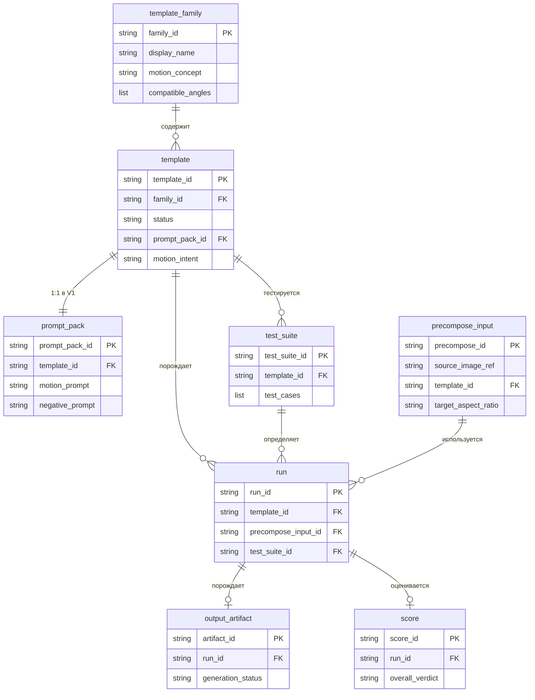

# Domain Model — food-video-template-lab

## Статус

Proposed

## Дата

2026-03-25

## Назначение документа

Этот документ определяет основные сущности проекта food-video-template-lab,
их ключевые атрибуты, роли в workflow и связи между собой.

Документ — концептуальная модель уровня Phase 1.
Строгая типизация и JSON-схемы появятся в Phase 2.

### Область действия

Domain model описывает сущности в рамках ограничений V1.
Canonical source of truth для V1 scope — [ADR-0002](adr/ADR-0002-v1-scope.md).

### Сопоставление с roadmap

Roadmap (Phase 1) перечисляет **9 доменных концептов**.
Domain model представляет их как **8 базовых сущностей + 1 lifecycle concept**:

- 8 сущностей: template_family, template, prompt_pack, precompose_input,
  test_suite, run, output_artifact, score.
- 1 lifecycle concept: `approved_template` реализован как значение поля
  `template.status`, а не как отдельная сущность.

Обоснование этого решения — в разделе
«Решение: approved_template — сущность или статус?».

---

## Сущности

### 1. template_family

**Определение:** Группа шаблонов, объединённых общей концепцией движения.
Family определяет «что мы делаем» на уровне motion concept, но не конкретные параметры.

**Ключевые атрибуты:**

- `family_id` — уникальный идентификатор (например `orbit_micro`)
- `display_name` — человекочитаемое название
- `motion_concept` — краткое описание типа движения
- `compatible_angles` — список допустимых angle families

**Роль в workflow:**
Организующая абстракция верхнего уровня. Определяет, какие angles допустимы
для шаблонов этого семейства. Конкретные templates — экземпляры внутри family.

**Стартовые families в V1:** `orbit_micro`, `dolly_in_clean`, `float_parallax`, `light_accent`.

---

### 2. template

**Определение:** Конкретный, тестируемый шаблон анимации. **Центральная сущность проекта.**
Описывает полную конфигурацию: движение, допустимые углы, связанный prompt pack,
правила precompose.

**Ключевые атрибуты:**

- `template_id` — уникальный идентификатор
- `family_id` — ссылка на template_family
- `version` — версия шаблона
- `status` — текущий статус жизненного цикла (см. «Статусная модель»)
- `supported_angles` — подмножество compatible_angles из family
- `supported_aspect_ratios` — из множества {1:1, 9:16, 16:9}
- `supported_durations` — протестированные и подтверждённые длительности
  в рамках V1 policy range (5–15s)
- `motion_intent` — текстовое описание ожидаемого движения
- `precompose_rules` — правила подготовки start frame
- `known_limitations` — известные ограничения
- `prompt_pack_id` — ссылка на связанный prompt_pack

**Роль в workflow:**
Пользователь выбирает template. Template определяет, какой prompt_pack использовать,
как подготовить start frame, какие параметры допустимы. Все runs привязаны к template.

**Примечание по duration:** `supported_durations` содержит только те значения,
которые реально подтверждены тестами для данного template. Template не обязан
поддерживать весь V1 policy range.

---

### 3. prompt_pack

**Определение:** Набор prompt-конфигураций, привязанный к конкретному template.
Содержит всё необходимое для формирования prompt к Kling API.

**Ключевые атрибуты:**

- `prompt_pack_id` — уникальный идентификатор
- `template_id` — обратная ссылка на template
- `version` — версия prompt pack
- `motion_prompt` — основной prompt движения
- `negative_prompt` — anti-drift guidance
- `prompt_modifiers` — условные модификаторы (по angle, aspect_ratio и т.д.)
- `stability_notes` — заметки о стабильности формулировок

**Роль в workflow:**
При генерации видео prompt_pack определяет, какой текст подаётся в Kling API.

**Инвариант V1:** template ↔ prompt_pack = **1:1**.
Один template — ровно один prompt_pack. A/B тестирование через несколько
prompt packs для одного template — за рамками V1.

---

### 4. precompose_input

**Определение:** Подготовленный стартовый кадр (start frame), сформированный
из исходного изображения блюда с учётом целевого aspect_ratio и правил template.

**Ключевые атрибуты:**

- `precompose_id` — уникальный идентификатор
- `source_image_ref` — ссылка на исходное изображение
- `template_id` — по правилам какого template подготовлен
- `target_aspect_ratio` — целевое соотношение сторон
- `angle_family` — ракурс исходного изображения
- `output_resolution` — итоговое разрешение
- `canvas_params` — параметры канвы (padding, position, background fill)
- `file_path` — путь к результирующему файлу

**Роль в workflow:**
Создаётся до запуска run. Правила precompose определяются template,
но конкретный precompose_input зависит от исходного изображения
и выбранного aspect_ratio.

Каждый run использует ровно один precompose_input.
Один precompose_input может быть переиспользован несколькими runs,
если будущая политика кэширования это разрешит (решение — Phase 3).

**Ключевой принцип V1:** aspect ratio обеспечивается через precompose,
а не через внутреннюю адаптацию Kling.

---

### 5. test_suite

**Определение:** Набор тест-кейсов для систематической проверки template.
Определяет, на каких входах и при каких условиях template должен быть протестирован.

**Ключевые атрибуты:**

- `test_suite_id` — уникальный идентификатор
- `template_id` — ссылка на template
- `test_cases` — список тест-кейсов (каждый: source_image, angle, aspect_ratio, duration)
- `scoring_criteria` — критерии оценки
- `min_pass_rate` — минимальный порог прохождения
- `notes` — примечания

**Роль в workflow:**
Определяет «программу испытаний» template. Каждый test_case при выполнении
порождает run. Test suite обеспечивает систематическую, а не случайную, проверку.

---

### 6. run

**Определение:** Единичное выполнение генерации видео — один вызов Kling API
с конкретными входными параметрами. Атомарная единица эксперимента.

**Ключевые атрибуты:**

- `run_id` — уникальный идентификатор
- `template_id` — какой template использовался
- `prompt_pack_id` — какой prompt_pack использовался
- `precompose_input_id` — какой start frame был подан
- `source_image_ref` — исходное изображение
- `angle_family` — ракурс
- `aspect_ratio` — соотношение сторон
- `duration` — длительность
- `api_request_params` — полные параметры запроса к Kling API
- `api_response_meta` — метаданные ответа (task_id, timestamps, status)
- `test_suite_id` — ссылка на test_suite (nullable для ad-hoc runs)
- `timestamp` — время запуска

**Роль в workflow:**
Основная единица данных для анализа. Каждый run порождает ровно один
output_artifact (или ноль при ошибке). Каждый run может получить один score.

**Уточнение:** run = один вызов API к Kling. Не пакет вызовов,
не весь test suite, а именно один запрос → один результат.

---

### 7. output_artifact

**Определение:** Результат run — видеофайл и сопутствующие метаданные,
полученные от Kling API.

**Ключевые атрибуты:**

- `artifact_id` — уникальный идентификатор
- `run_id` — ссылка на run
- `video_url` — URL видео от Kling API
- `video_file_path` — локальный путь к скачанному видео
- `thumbnail_path` — путь к превью
- `duration_actual` — фактическая длительность
- `resolution` — разрешение
- `file_size` — размер файла
- `generation_status` — статус генерации (success, failed, timeout)

**Роль в workflow:**
Материал для оценки. Score присваивается на основе анализа output_artifact.
Хранится в `runs/` (gitignored).

---

### 8. score

**Определение:** Результат оценки конкретного run. Фиксирует,
насколько хорошо template отработал на данном входе.

**Ключевые атрибуты:**

- `score_id` — уникальный идентификатор
- `run_id` — ссылка на run
- `evaluator` — кто/что оценивал (human, auto-rule, LLM-judge)
- `criteria_results` — результаты по отдельным критериям
- `overall_verdict` — общий вердикт (pass, fail, marginal)
- `notes` — комментарии оценщика
- `timestamp` — время оценки

**Возможные критерии оценки** (уточняются в Phase 5):

- сохранность формы блюда
- стабильность движения камеры
- соответствие motion_intent
- чистота фона
- отсутствие артефактов и лишних объектов
- повторяемость результата

**Роль в workflow:**
Данные для принятия решений о статусе template. Агрегация scores
по test_suite позволяет решить: refine, hold, reject или approve.

---

## Решение: approved_template — сущность или статус?

### Рекомендация

**Статус на сущности template, а не отдельная сущность.**

### Обоснование

1. **Принцип простоты.** Отдельная сущность вводит дублирование данных
   и дополнительную сложность без необходимости в V1.

2. **Roadmap уже определяет lifecycle.** Phase 7 явно перечисляет статусы:
   draft → in_test → candidate → approved → archived.
   «Approved» — это состояние в lifecycle, а не отдельная сущность.

3. **Нет production-specific metadata.** В V1 нет внешних потребителей,
   нет API contract. Когда в Phase 8 появится handoff, это будет
   отдельная сущность `handoff_package`, а не «approved template».

4. **Синхронизация.** Если approved_template — копия template
   с дополнительными полями, возникает вопрос: что при обновлении template?
   Ненужная сложность.

### Вывод

Domain model определяет **8 базовых сущностей**.
«Approved» — значение поля `status` на template.
Если в будущем потребуется production-specific metadata,
создаётся `handoff_package` (Phase 8), а не дублируется template.

---

## Статусная модель template (preview)

Полная проработка статусной модели — Phase 7.
Здесь фиксируется preview для ориентира:

```
draft → in_test → unstable → needs_revision → candidate → approved → archived
                      ↑            |
                      └────────────┘
```

- `draft` — шаблон описан, но не тестировался
- `in_test` — идёт активное тестирование
- `unstable` — тесты показали нестабильность
- `needs_revision` — требуется доработка prompt/precompose
- `candidate` — стабильные результаты, кандидат на approval
- `approved` — прошёл все проверки, готов к production handoff
- `archived` — выведен из использования

---

## Связи между сущностями

### Диаграмма



### Описание ключевых связей

| Связь | Кардинальность | Пояснение |
|-------|---------------|-----------|
| template_family → template | 1 : N | Семейство содержит один или более templates |
| template ↔ prompt_pack | 1 : 1 | **Инвариант V1.** В будущем может стать 1:N для A/B |
| template → test_suite | 1 : N | Template может иметь несколько test suites |
| template → run | 1 : N | Template может быть запущен множество раз |
| test_suite → run | 1 : N | Каждый test_case в suite порождает run |
| precompose_input → run | 1 : N | Один precompose_input может быть переиспользован несколькими runs |
| run → output_artifact | 1 : 0..1 | Успешный run порождает один artifact |
| run → score | 1 : 0..1 | Run может быть оценён (или ещё не оценён) |

---

## Матрица совместимости template_family × angle_family

ADR-0002 (п. 7) фиксирует: не все комбинации template_family × angle_family
обязаны быть допустимыми. Ниже представлена рабочая гипотеза совместимости.

> **Статус:** working hypothesis (Phase 1).
> Все значения являются инженерными предположениями и подлежат
> обязательной валидации по результатам test runs в Phase 6.
> До валидации эта матрица не является подтверждённым фактом.

| template_family  | top_down | three_quarter | hero_side |
|------------------|----------|---------------|-----------|
| orbit_micro      | ✓        | ✓             | ✓         |
| dolly_in_clean   | ?        | ✓             | ✓         |
| float_parallax   | ✓        | ✓             | ?         |
| light_accent     | ✓        | ✓             | ✓         |

**Легенда:** `✓` = предположительно допустимо, `?` = требует проверки, `✗` = запрещено.

**Логика предположений:**

- **orbit_micro** — микро-орбита. Малое вращательное движение предположительно
  работает для всех ракурсов.
- **dolly_in_clean** — наезд камеры. На top_down блюдо уже заполняет кадр,
  наезд может быть менее выразительным → `?`.
- **float_parallax** — лёгкий параллакс. На hero_side боковой ракурс может
  дать нестабильный параллакс → `?`.
- **light_accent** — акцент через свет. Не зависит от ракурса,
  предположительно работает для всех.

---

## Инварианты V1

Собраны из [ADR-0002](adr/ADR-0002-v1-scope.md). Нарушение любого из них
выходит за рамки V1 и требует нового ADR.

1. template ↔ prompt_pack = 1:1
2. Single-shot only, start frame only
3. Aspect ratio через precompose (не через Kling)
4. Только internal images
5. Одно блюдо, однотонный фон, safe area
6. Только 3 angle families: top_down, three_quarter, hero_side
7. Только 4 стартовых template families
8. V1 policy range для duration: 5–15s; конкретные supported_durations
   определяются per-template через тестирование
9. mode=pro, sound=false, multi_shots=false
10. Не все template_family × angle_family комбинации обязательны

---

## Открытые вопросы

Эти вопросы осознанно оставлены открытыми на Phase 1.
Каждый будет решён в соответствующей фазе.

| # | Вопрос | Решается в |
|---|--------|-----------|
| 1 | Точный формат source_image_ref (path, URL, ID?) | Phase 3 |
| 2 | Политика кэширования precompose_input (переиспользование между runs) | Phase 3 |
| 3 | Единая scoring rubric или per-template? | Phase 5 |
| 4 | Стратегия версионирования template и prompt_pack | Phase 2 |
| 5 | Валидация матрицы совместимости (кто, когда, как) | Phase 6 |

---

## Ссылки

- [ADR-0002 — Границы и ограничения V1](adr/ADR-0002-v1-scope.md)
- [Roadmap](roadmap.md)
- [Project Map](project-map.md)
